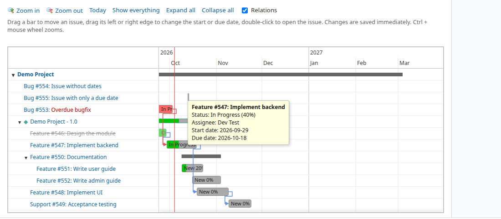

# redmine_vis_gantt

An experimental Gantt chart for Redmine built on [vis-timeline](https://visjs.github.io/vis-timeline/).
It sits **next to** the built-in Gantt (nothing is replaced), shows the same issues, and lets you
**reschedule issues with the mouse**: drag a bar to move an issue, drag its left or right edge to
change the start or due date.



The point of the prototype is to see how an interactive timeline feels in Redmine and to find out what
it takes to build on it (for example a resource/equipment Gantt where the rows are resources and the
bars are bookings).

## What you get

* Same rows as the built-in Gantt, in the same order: projects, subprojects, versions, issues, issue
  hierarchy. The page reuses `Redmine::Helpers::Gantt` for the selection, so query filters, issue
  visibility, saved queries and the "maximum number of items" setting behave exactly as they do there.
* Bars show the done ratio and the part that is behind schedule (same colours as the built-in Gantt);
  parent issues and projects are drawn as thin summary bars; closed issues are faded.
* **Drag to reschedule.** Move a bar, or resize it from either end. Bars snap to whole days. The change
  is saved immediately and the chart reloads, because Redmine may have moved other issues (see below).
* "Blocks" and "precedes" relations are drawn as arrows.
* Collapse/expand branches, zoom (buttons or Ctrl + wheel), "Today", "Show everything", double-click a
  bar to open the issue, tooltips with status, assignee and dates.
* Texts in English and Russian; the time axis follows the user's language.
* A top-menu entry and a project-menu tab "Gantt (vis-timeline)". URLs: `/vis_gantt` and
  `/projects/:id/vis_gantt`.

## How saving works

A drop sends `PUT /vis_gantt/issues/:id/dates` with the new dates and the issue's `lock_version`. The
controller loads the issue, calls `init_journal` and assigns the dates through `safe_attributes=`, i.e.
through exactly the code path of the issue edit form. So, without any extra code here:

* permissions and workflow "read-only" fields are respected (a field the user may not edit is refused
  with a 403 and the bar jumps back);
* validations apply (for example a successor cannot start before its predecessor ends);
* **following issues are rescheduled** by Redmine, and **parents with derived dates** follow their
  children, which is why the chart reloads after every successful save;
* a history entry is written and the usual notifications are sent;
* a concurrent change by somebody else is detected through `lock_version` (409, chart refreshed).

Parents whose dates are derived from their subtasks are not draggable.

## Permissions

The plugin adds none. Whoever may see the built-in Gantt (`view_gantt`, module "Gantt") may see this
one, and whoever has `edit_issues` or `edit_own_issues` may move dates (per issue, as on the edit form).
The plugin attaches its controller actions to those existing permissions in `lib/redmine_vis_gantt.rb`.

## Installation

```
cd /path/to/redmine/plugins
cp -r /path/to/redmine_vis_gantt .        # or git clone / symlink
# no migrations, no gems; restart Redmine
```

Tested on **Redmine 6.1.5** (Rails 7.2) and **Redmine 7.0.2** (Rails 8.1) with Ruby 3.3 and SQLite.
The plugin declares `requires_redmine version_or_higher: '6.0.0'`.

## Layout

```
init.rb                               registration, menu entries, permission wiring
config/routes.rb                      page, data endpoint, date update endpoint
app/controllers/vis_gantts_controller.rb
app/views/vis_gantts/show.html.erb    filters form + chart container (config as a data attribute)
lib/redmine_vis_gantt/chart_data.rb   Gantt helper output -> flat list of rows for the browser
assets/javascripts/vis_gantt.js       rows -> vis-timeline groups/items, drag handling, relation arrows
assets/javascripts/vis-timeline-graph2d.min.js   vendored vis-timeline 8.5.4 (includes its CSS)
test/                                 functional tests (Redmine's test framework)
dev/                                  demo data and browser scenarios (development only)
licenses/vis-timeline/                vis-timeline licenses (Apache-2.0 OR MIT)
```

Notes for hacking on it:

* The data and update endpoints deliberately have **no `.json` suffix**. Redmine treats `*.json`
  requests as API requests and ignores the browser session for them.
* Dates are inclusive, as everywhere in Redmine; the JS turns a due date into an exclusive end
  (`due + 1 day`) for vis-timeline and back.
* Each row is a vis-timeline *group* (the left column) with at most one *item* (the bar). Collapsing
  toggles the groups' `visible` flag; the hierarchy comes from `parent`/`depth` in the data.
* vis-timeline's standalone bundle injects its own CSS when the script runs, i.e. after the plugin
  stylesheet, so rules overriding it must be more specific (they are prefixed with `#vis-gantt`).
* To upgrade vis-timeline, replace the vendored file with `standalone/umd/vis-timeline-graph2d.min.js`
  from the npm package.

## Tests

```
# unit/functional tests (Redmine's framework; run inside a Redmine checkout with a test database)
RAILS_ENV=test bundle exec rake redmine:plugins:test NAME=redmine_vis_gantt
# if the plugin directory is a symlink, point the helper at the Redmine root:
REDMINE_ROOT=/path/to/redmine RAILS_ENV=test bundle exec rake redmine:plugins:test NAME=redmine_vis_gantt
```

42 tests: data shape and ordering, hierarchy, editable flags, workflow read-only fields, relations,
query filters, private issues, row limit, permissions, closed projects, stale `lock_version`,
malformed input, rescheduling of followers and derived parents.

Browser scenarios (real Chromium via Playwright, real mouse drags) are in `dev/e2e`:

```
RAILS_ENV=development bundle exec rails runner plugins/redmine_vis_gantt/dev/seed_demo.rb  # demo data
bundle exec rails server &
cd plugins/redmine_vis_gantt/dev/e2e && npm install
BASE=http://127.0.0.1:3000 node drag.js   # moving, resizing, followers, invalid moves, CSRF, history
BASE=http://127.0.0.1:3000 node ui.js     # permissions, collapse, zoom, filters, double-click, Russian
```

(`seed_demo.rb` resets the admin password and creates demo users: development databases only.)
Set `CHROME_PATH` to use an already installed Chromium.

## Performance

Measured in a development-mode Redmine on 470 issues (the default row limit is 500): the page is
rendered server-side in about 1.1 s versus about 2.3 s for the built-in Gantt on the same data;
panning in the browser costs about 15 ms per frame. vis-timeline only keeps the bars of the visible
time range in the DOM.

## Known limitations

* **Relation arrows** are drawn between bars that are currently in the DOM; an arrow to a bar outside
  the visible time range is not drawn.
* Not implemented compared to the built-in Gantt: PDF/PNG export, "display selected columns", the
  progress line, month/zoom parameters in the URL and in saved queries (the initial window is the
  current month plus six months; use zoom or "Show everything").
* Non-working days are not shaded according to Redmine's setting.
* Day granularity only (no time of day). Project and version bars are not draggable.
* An issue with no dates at all has no bar, so its dates cannot be set from the chart; issues with
  only one date are drawn as a one-day bar.
* Dragging starts after about 10 px of mouse movement (vis-timeline/Hammer.js dead zone).
* The row selection relies on the public methods of `Redmine::Helpers::Gantt` (`projects`, `issues`,
  `project_versions`, `relations`, ...). It works on 6.1 and 7.0 but should be re-checked on upgrades.

## Towards a resource Gantt

The structure carries over directly: rows = resources, bars = bookings, drag = change the booking.
What would change is the data (a `Resource` and a `Booking` model, conflict detection under a lock on
the resource row, per-resource calendars) and the update endpoint; the timeline, the drag handling
(snapping, validation in `onMoving`, optimistic update with rollback on `422`) and the Redmine
integration (menu, permissions, CSRF-protected session endpoints, tests) are already here.
